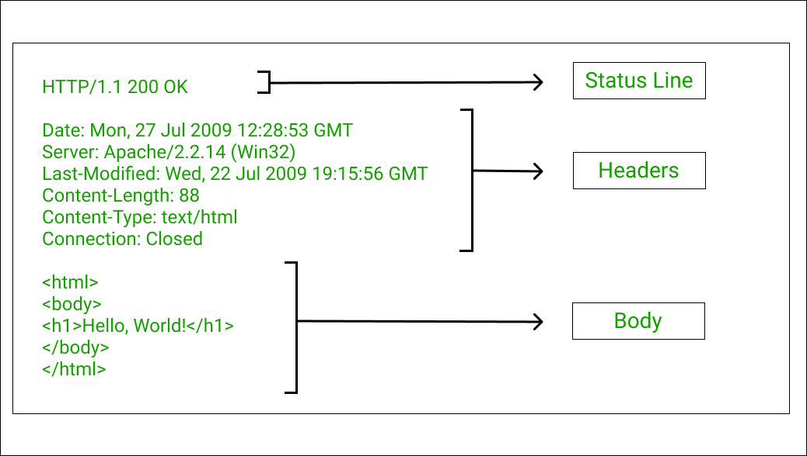
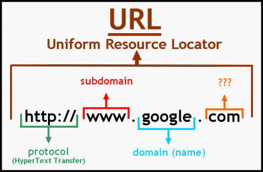

## `The HTTP Protocol` 

Giao thức HTTP (Hypertext Transfer Protocol) là giao thức truyền thông cốt lõi được sử dụng để truy cập World Wide Web và được sử dụng bởi tất cả các ứng dụng web hiện nay. 

HTTP sử dụng một mô hình dựa trên tin nhắn, trong đó một máy khách gửi một thông điệp yêu cầu và máy chủ trả về một thông điệp phản hồi. 

## `HTTP Requests`
Đây chính là tập hợp thông tin được gửi từ các máy khách (client) đến máy chủ (server). Nó là những yêu cầu cần máy chủ tìm kiếm, xử lý sau đó phản hồi kết quả lại client. 
Bất cứ HTTP Request nào cũng có cấu trúc cụ thể gồm 3 thành phần chính. Đó là Request line, Request header và Body Request. 


 1. **Request Line** : Là dòng xuất hiện đầu tiên trong các yêu cầu HTTP. Trong thành phần này lại bao gồm 3 yếu tố.
    - Phương thức HTTP được sử dụng.
    - URI: Thành phần giúp máy chủ xác định các tài nguyên mà máy khách yêu cầu.
    - Phiên bản của giao thức internet HTTP.

2. **HTTP Request header** : Đây chính là thành phần giúp các yêu cầu từ client có thể chuyển đến server.Trong đó, mỗi yêu cầu chứa đựng các thông số (được gọi là Header Parameters).
Sau khi nhận được yêu cầu từ client, trình duyệt và máy chủ phản hồi lại. Thiết bị sẽ căn cứ theo thông số header nhận được để hiển thị dữ liệu phù hợp nhất.

    Các thông số header gặp phổ biến trong HTTP Request như sau:

    - User-Agent: Thông số giúp máy chủ xác định được nhà cung cấp, ứng dụng, hệ điều hành và phiên bản.
    - Connection: Cho phép hệ thống tiếp tục hoặc dừng kết nối sau khi máy chủ xử lý xong các yêu cầu.
    - Cache-Control: Thực hiện chỉ định chính sách bộ nhớ đệm mà trình duyệt phụ trách.
    - Accept-Language: Thông số chỉ các ngôn ngữ mà các client có thể hiểu được.


## `HTTP Responses`  
HTTP Response là thông báo phản hồi mà server gửi về cho client sau khi client gửi một HTTP request đến server, server sẽ xử lý yêu cầu đó và gửi lại một HTTP response để trả lời client.



Cấu trúc của một HTTP response:

- Một Status-line = Phiên bản HTTP + Mã trạng thái + Trạng thái
- Có thể có hoặc không có các trường header
- Một dòng trống để đánh dấu sự kết thúc của các trường header
- Tùy chọn một thông điệp

Để hiểu rõ hơn về một HTTP response :

- HTTP version: phiên bản giao thức HTTP mà server đang sử dụng.
- Mã trạng thái (status code): mô tả trạng thái của yêu cầu.
- Reason phrase: mô tả về Status-Code
- Header: chứa thông tin về response như Content-Type, Content-Length, Date, Server, vv.
- Body: nội dung của response, có thể là dữ liệu mà server gửi về cho client.

Mã trạng thái (status code) là một phần quan trọng của HTTP response, nó cho biết thành công hay thất bại của yêu cầu. Các mã trạng thái thường gặp bao gồm:
- 2xx: thành công
- 3xx: chuyển hướng
- 4xx: lỗi từ client
- 5xx: lỗi từ server

Ví dụ: Nếu client gửi một yêu cầu HTTP GET đến server để truy cập vào một trang web, server sẽ xử lý yêu cầu và gửi response trở lại cho client. HTTP response có thể chứa mã trạng thái 200 OK, header có thông tin về Content-Type và Content-Length, và body chứa nội dung HTML của trang web đó.

## `HTTP Request Methods`
Có tất cả 9 loại request, get và post là 2 loại thông dụng được sử dụng nhiều.
```
GET: được sử dụng để lấy thông tin từ sever theo URI đã cung cấp.
HEAD: giống với GET nhưng response trả về không có body, chỉ có header
POST: gửi thông tin tới sever thông qua các biểu mẫu http
PUT: ghi đè tất cả thông tin của đối tượng với những gì được gửi lên
PATCH: ghi đè các thông tin được thay đổi của đối tượng.
DELETE: xóa tài nguyên trên server.
CONNECT: thiết lập một kết nối tới server theo URI.
OPTIONS: mô tả các tùy chọn giao tiếp cho resource.
TRACE: trình bày một vòng lặp kiểm tra thông báo song song với path tới nguồn mục tiêu.
```

## `URLs`
URL là chữ viết tắt của “Uniform Resource Locator“, tạm dịch: “Trình định vị tài nguyên thống nhất“. Đây là một đường dẫn liên kết đến website, tham chiếu tới các tài nguyên trên mạng Internet.

Mục đích : Mỗi website như một ngôi nhà có địa chỉ IP riêng. Địa chỉ IP gồm một dãy số dài, phức tạp và khó nhớ. Để thuận tiện cho người truy cập, địa chỉ IP này được chuyển sang ngôn ngữ mà con người có thể dễ nhớ. 

**Phân loại URL : hầu hết mọi website đều sẽ có cả 2 loại URL bao gồm:**
- URL động (?id=..)
- URL tĩnh (.html)

1. URL động (?id=..)
Đây là URL có thể thay đổi. Thông thường, các diễn đàn hoặc website thiết kế mã nguồn mở sẽ dùng URL động. URL động bị đánh giá là không thân thiện với công cụ tìm kiếm.

2. URL tĩnh (.html)
Đây là URL không thể thay đổi. So với URL động, URL tĩnh được xếp hạng tốt hơn trong công cụ tìm kiếm, được index nhanh hơn. 

**Cấu trúc**



Thông thường, một URL sẽ gồm những thành phần cơ bản như sau: 
- Giao thức: http, https, FTP…
- World Wide Web
- Tên miền (domain) 
- Cổng giao tiếp (port): 443, 80, 2082, 2222…

>protocol://hostname[:port]/[path/]file[?param=value]

Note : Bạn có thể gặp thuật ngữ URI (uniform resource identifier) được sử dụng thay vì URL

## `HTTP Headers`

**General Headers**

1. Connection: thông báo cho đầu bên kia xem liệu có nên đóng kết nối TCP sau khi quá trình truyền HTTP hoàn tất hay giữ nó mở để gửi thông điệp tiếp theo.

2. Content-Encoding: xác định loại mã hóa được sử dụng cho nội dung trong phần message body, chẳng hạn như gzip, loại mà sử dụng để nén các phản hồi (responses) để truyền nhanh hơn.

3. Content-Length: chỉ định độ dài của message body, tính bằng byte 

4. Content-Type: chỉ định loại nội dung nằm trong message body, chẳng hạn như text/html 

5. Transfer-Encoding: chỉ định bất kỳ mã hóa nào đã được thực hiện trên message body để dễ dàng truyền qua HTTP.

**Request Headers**

1. Accept: thông báo cho server biết loại nội dung mà client sẵn sàng chấp nhận, chẳng hạn như các loại hình ảnh, định dạng tài liệu văn phòng và nhiều nội dung khác.

2. Accept-Encoding: thông báo cho server biết loại mã hóa nội dung mà client sẵn sàng chấp nhận.

3. Authorization: gửi thông tin đăng nhập (credentials) đến server cho một trong các loại xác thực HTTP tích hợp sẵn.

4. Cookie: gửi các cookie đến server, mà server đã cấp trước đó.

5. Host: chỉ định tên máy chủ (hostname) xuất hiện trong URL đầy đủ đang được yêu cầu.

6. If-Modified-Since: chỉ định thời điểm mà trình duyệt cuối cùng nhận được tài nguyên được yêu cầu. Nếu tài nguyên không thay đổi kể từ thời điểm đó, server có thể chỉ đạo client sử dụng bản sao được lưu trong bộ nhớ đệm của nó, bằng cách sử dụng một respone với status code 304.

7. If-None-Match: chỉ định một thẻ thực thể (entity tag), đó là một định danh biểu thị nội dung của message body. Trình duyệt gửi entity tag mà server cấp với tài nguyên được yêu cầu khi nó được nhận lần cuối. Server có thể sử dụng entity tag để xác định xem trình duyệt có thể sử dụng bản sao trong bộ nhớ đệm của nó của tài nguyên hay không.

8. Origin: được sử dụng trong các yêu cầu Ajax giao qua miền (cross-domain) để chỉ ra tên miền nguồn mà yêu cầu xuất phát.

9. Referer: chỉ định URL mà yêu cầu hiện tại xuất phát.

10. User-Agent: cung cấp thông tin về trình duyệt hoặc phần mềm client khác đã tạo ra yêu cầu.

**Response Headers**

1. Access-Control-Allow-Origin: chỉ định xem tài nguyên có thể được truy xuất thông qua các yêu cầu Ajax giao qua miền (cross-domain) hay không .

2. Cache-Control: chuyển các chỉ thị về bộ nhớ đệm đến trình duyệt (ví dụ: no-cache).

3. ETag: chỉ định một thẻ thực thể (entity tag). Các máy client có thể gửi định danh này trong các requests tiếp theo cho cùng một tài nguyên trong If-None-Match header để thông báo cho server, phiên bản nào của tài nguyên mà trình duyệt đang giữ trong bộ nhớ đệm của nó.

4. Expires: thông báo cho trình duyệt về thời gian mà nội dung message body còn hiệu lực. Trình duyệt có thể sử dụng bản sao trong bộ nhớ đệm (cache) của nó thuộc tài nguyên này cho đến thời điểm còn hiệu lực.

5. Location: được sử dụng trong phản hồi chuyển hướng(redirection responses) (có status code bắt đầu bằng 3xx) để chỉ định đích của chuyển hướng.

6. Pragma: chuyển các chỉ thị về bộ nhớ đệm đến trình duyệt (ví dụ: no-cache).

7. Server: cung cấp thông tin về phần mềm máy chủ web đang được sử dụng.

8. Set-Cookie: gửi các cookie đến trình duyệt , cái mà trình duyệt sẽ gửi lại cho máy chủ trong các requests tiếp theo.

9. WWW-Authenticate: được sử dụng trong các phản hồi có status code 401 để cung cấp thông tin về loại xác thực nào mà máy chủ(server) hỗ trợ.

10. X-Frame-Options: chỉ định xem liệu cách phản hồi hiện tại có thể được tải trong khung (frame) trình duyệt hay không 

## `Cookies`
Đây là những file được trang web tạo ra để lưu lại các thông tin về hoạt động duyệt web của người dùng. Chúng giúp lưu trữ các thông tin như tên đăng nhập, mật khẩu và các cài đặt cá nhân của người dùng. Điều này giúp cho việc truy cập vào website trở nên nhanh chóng và thuận tiện hơn.

Máy chủ cấp một cookie bằng cách sử dụng response header Set-Cookie, như bạn đã thấy:
```
Set-Cookie: tracking=tI8rk7joMx44S2Uu85nSWc
```
Trình duyệt của người dùng sau đó tự động thêm header sau vào các yêu cầu tiếp theo gửi đến cùng máy chủ:
```
Cookie: tracking=tI8rk7joMx44S2Uu85nSWc
```
Ngoài giá trị thực tế của cookie, the Set-Cookie header có thể bao gồm bất kỳ thuộc tính tùy chọn nào sau đây, có thể được sử dụng để kiểm soát cách trình duyệt xử lý cookie:

1. expires: Đặt một ngày đến khi cookie còn hiệu lực. Điều này khiến trình duyệt lưu cookie vào bộ nhớ lâu dài và nó sẽ được sử dụng trong các phiên trình duyệt sau này cho đến khi đạt đến ngày hết hạn. Nếu thuộc tính này không được đặt, cookie chỉ được sử dụng trong phiên trình duyệt hiện tại.

2. domain: Xác định tên miền cho cookie. Điều này phải là tên miền giống hoặc là tên miền cha của tên miền mà cookie được nhận.

3. path: Xác định đường dẫn URL cho cookie có hiệu lực.

4. secure: Nếu thuộc tính này được đặt, cookie sẽ chỉ được gửi trong các yêu cầu HTTPS.

5. HttpOnly: Nếu thuộc tính này được đặt, cookie không thể được truy cập trực tiếp thông qua JavaScript phía máy khách.

Mỗi một trong những thuộc tính cookie này có thể ảnh hưởng đến bảo mật của ứng dụng. 

## `Status Code`
1xx: Yêu cầu đã được chấp nhận và quá trình xử lý yêu cầu đang được tiếp tục.

2xx: Yêu cầu đã được máy chủ tiếp nhận, hiểu và xử lý thành công.

3xx: Chuyển hướng, phía client cần thực hiện hành động bổ sung để hoàn tất yêu cầu.

4xx: Lỗi phía client – Yêu cầu không thể hoàn tất hoặc yêu cầu chứa cú pháp không chính xác. 4xx sẽ hiện ra khi có lỗi từ phía client do không đưa ra yêu cầu hợp lệ.

5xx: Lỗi phía server – Máy chủ không thể hoàn thành yêu cầu được cho là hợp lệ. Khi 5xx xảy ra, bạn chỉ có thể đợi để bên hệ thống máy chủ xử lý xong.

Có rất nhiều Status Code , nhiều mã chỉ được sử dụng trong hoàn cảnh đặc biệt. Dưới đây là các status code có nhiều khả năng gặp phải nhất khi tấn công một ứng dụng web:

1. 100 Continue - Phản hồi tạm thời này cho biết rằng mọi thứ tới hiện tại vẫn ổn và phía client nên tiếp tục yêu cầu hay bỏ qua phản hồi nếu yêu cầu đã hoàn tất.

2. 200 OK - Chỉ ra rằng yêu cầu đã thành công 

3. 201 Created - Yêu cầu đã thành công và kết quả là một tài nguyên mới đã được tạo. Đây thường là phản hồi được gửi sau các yêu cầu POST hoặc một số yêu cầu PUT.

4. 301 Moved Permanently - URL của tài nguyên được yêu cầu đã được thay đổi vĩnh viễn. URL mới được đưa ra trong phần phản hồi

5. 302 Found - Code phản hồi này có nghĩa là URI của tài nguyên được yêu cầu đã được thay đổi tạm thời. Những thay đổi khác trong URI có thể được thực hiện trong tương lai. Do đó, chính URI này sẽ được client sử dụng trong các yêu cầu trong tương lai.

6. 304 Not Modified -  Code này được sử dụng cho mục đích caching. Nó cho client biết rằng phản hồi chưa được điều chỉnh, nên client có thể tiếp tục sử dụng cùng phiên bản phản hồi trong bộ nhớ cache.

7. 400 Bad Request - Máy chủ không thể hiểu yêu cầu do cú pháp không hợp lệ.

8. 401 Unauthorized - Chỉ ra rằng server yêu cầu xác thực HTTP trước khi request được cấp phép. WWW-Authenticate header chứa thông tin về các loại xác thực được hỗ trợ.

9. 403 Forbidden - Chỉ ra rằng không ai được phép truy cập tài nguyên được yêu cầu, bất kể việc xác thực.

10. 404 Not Found - Chỉ ra rằng tài nguyên được yêu cầu không tồn tại.

11. 405 Method Not Allowed - Chỉ ra rằng phương thức được sử dụng trong yêu cầu không được hỗ trợ cho URL cụ thể. Ví dụ, bạn có thể nhận được status code này nếu bạn cố gắng sử dụng phương thức PUT ở nơi nó không được hỗ trợ.

12. 413 Request Entity Too Large - Thực thể yêu cầu lớn hơn giới hạn do máy chủ xác định, máy chủ có thể đóng kết nối hoặc trả về trường header Retry-After.

13. 414 Request URI Too Long - Tương tự như mã trạng thái 413, mã trạng thái này chỉ ra rằng URL trong yêu cầu quá lớn để máy chủ xử lý.

14. 500 Internal Server Error - Một thông báo chung, được đưa ra khi máy chủ gặp phải một trường hợp bất ngờ, message cụ thể không phù hợp.
15. 503 Service Unavailable - Máy chủ hiện tại không có sẵn (hiện đang quá tải hoặc bị down để bảo trì). Đây chỉ là trạng thái tạm thời.

## `HTTPS`
HTTPS (Hypertext Transfer Protocol Secure) là giao thức truyền tải siêu văn bản an toàn. Thực chất, đây chính là giao thức HTTP nhưng tích hợp thêm Chứng chỉ bảo mật SSL nhằm mã hóa các thông điệp giao tiếp để tăng tính bảo mật. Có thể hiểu, HTTPS là phiên bản HTTP an toàn, bảo mật hơn.

## `HTTP Proxies`
HTTP proxy là một máy chủ hoạt động như một trung gian giữa trình duyệt client  và web server. Khi một trình duyệt đã được cấu hình để sử dụng một máy chủ proxy, nó gửi tất cả các yêu cầu của mình đến máy chủ đó. Cổng proxy truyền các yêu cầu đến các máy chủ web liên quan và chuyển tiếp phản hồi từ các máy chủ web đó trở lại trình duyệt. Hầu hết các cổng proxy cung cấp các dịch vụ bổ sung, bao gồm bộ nhớ đệm, xác thực và kiểm soát truy cập.

## `HTTP Authentication`
Giao thức HTTP bao gồm các cơ chế xác thực người dùng riêng biệt sử dụng các loại giải pháp xác thực khác nhau, bao gồm các loại sau:

1. Basic : là một cơ chế xác thực đơn giản gửi thông tin đăng nhập của người dùng dưới dạng một chuỗi đã được mã hóa dưới dạng Base64 trong request header với mỗi thông điệp.

2. NTLM : là một cơ chế challenge-response phổ biến trong môi trường Microsoft Windows. Nó được sử dụng để xác thực người dùng khi truy cập các tài nguyên mạng trong hệ thống Windows. NTLM thường không được sử dụng trong các ứng dụng web triển khai trên Internet, nhưng nó thường được áp dụng trong môi trường doanh nghiệp và mạng nội bộ sử dụng các dịch vụ Microsoft.

3. Digest : là một cơ chế challenge-response. Nó được sử dụng để bảo vệ tính bảo mật của thông tin đăng nhập của người dùng trong quá trình truy cập tài nguyên web. Điểm quan trọng của Digest Authentication là không gửi mật khẩu người dùng dưới dạng văn bản thô qua mạng, giúp bảo vệ thông tin đăng nhập của họ khỏi việc lộ trình

"Basic authentication is insecure."
Basic authentication đặt thông tin đăng nhập dưới dạng văn bản thô trong yêu cầu HTTP, nên thường được nói rằng giao thức này không an toàn và không nên được sử dụng. 
>Bất kỳ thông điệp HTTP nào cũng có thể được bảo vệ khỏi các cuộc tấn công nghe trộm bằng cách sử dụng HTTPS như một cơ chế truyền tải.
