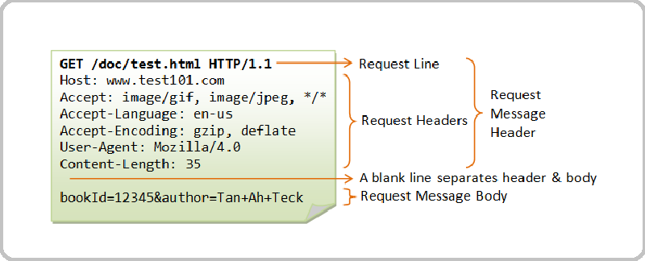

## `The HTTP Protocol` 

Giao thức HTTP (Hypertext Transfer Protocol) là giao thức truyền thông cốt lõi được sử dụng để truy cập World Wide Web và được sử dụng bởi tất cả các ứng dụng web hiện nay. 

HTTP sử dụng một mô hình dựa trên tin nhắn, trong đó một máy khách gửi một thông điệp yêu cầu và máy chủ trả về một thông điệp phản hồi. 

## `HTTP Requests`
Đây chính là tập hợp thông tin được gửi từ các máy khách (client) đến máy chủ (server). Nó là những yêu cầu cần máy chủ tìm kiếm, xử lý sau đó phản hồi kết quả lại client. 
Bất cứ HTTP Request nào cũng có cấu trúc cụ thể gồm 3 thành phần chính. Đó là Request line, Request header và Body Request. Dưới đây là những thông tin chi tiết về cấu trúc của một HTTP Request điển hình :

Dòng đầu tiên của mỗi yêu cầu HTTP bao gồm 3 phần, được ngăn cách bởi khoảng trắng:

 1. **Request Line** : Là dòng xuất hiện đầu tiên trong các yêu cầu HTTP. Trong thành phần này lại bao gồm 3 yếu tố.
    - Phương thức HTTP được sử dụng.
    - URI: Thành phần giúp máy chủ xác định các tài nguyên mà máy khách yêu cầu.
    - Phiên bản của giao thức internet HTTP.

2. **HTTP Request header** : Đây chính là thành phần giúp các yêu cầu từ client có thể chuyển đến server.Trong đó, mỗi yêu cầu chứa đựng các thông số (được gọi là Header Parameters).
Sau khi nhận được yêu cầu từ client, trình duyệt và máy chủ phản hồi lại. Thiết bị sẽ căn cứ theo thông số header nhận được để hiển thị dữ liệu phù hợp nhất.

    Các thông số header gặp phổ biến trong HTTP Request như sau:

        User-Agent: Thông số giúp máy chủ xác định được nhà cung cấp, ứng dụng, hệ điều hành và phiên bản.
        Connection: Cho phép hệ thống tiếp tục hoặc dừng kết nối sau khi máy chủ xử lý xong các yêu cầu.
        Cache-Control: Thực hiện chỉ định chính sách bộ nhớ đệm mà trình duyệt phụ trách.
        Accept-Language: Thông số chỉ các ngôn ngữ mà các client có thể hiểu được.

## `HTTP Responses`  
HTTP Response là thông báo phản hồi mà server gửi về cho client sau khi nhận được yêu cầu HTTP từ client. Khi client gửi một HTTP request đến server, server sẽ xử lý yêu cầu đó và gửi lại một HTTP response để trả lời client.

HTTP response bao gồm các thông tin cơ bản như mã trạng thái (status code) để đánh giá trạng thái của yêu cầu, header để chứa thông tin về response, và body để chứa dữ liệu mà server gửi về.
Mã trạng thái (status code) là một phần quan trọng của HTTP response, nó cho biết thành công hay thất bại của yêu cầu. Các mã trạng thái thường gặp bao gồm:
- 2xx: thành công
- 3xx: chuyển hướng
- 4xx: lỗi từ client
- 5xx: lỗi từ server

Để hiểu rõ hơn về một HTTP response, ta cần xem chi tiết cấu trúc của nó. Một HTTP response bao gồm:
- HTTP version: phiên bản giao thức HTTP mà server đang sử dụng.
- Mã trạng thái (status code): số ba chữ số mô tả trạng thái của yêu cầu.
- Reason phrase: nguyên nhân mô tả trạng thái của yêu cầu.
- Header: chứa thông tin về response như Content-Type, Content-Length, Date, Server, vv.
- Body: nội dung của response, có thể là dữ liệu mà server gửi về cho client.

Ví dụ: Nếu client gửi một yêu cầu HTTP GET đến server để truy cập vào một trang web, server sẽ xử lý yêu cầu và gửi response trở lại cho client. HTTP response có thể chứa mã trạng thái 200 OK, header có thông tin về Content-Type và Content-Length, và body chứa nội dung HTML của trang web đó.

